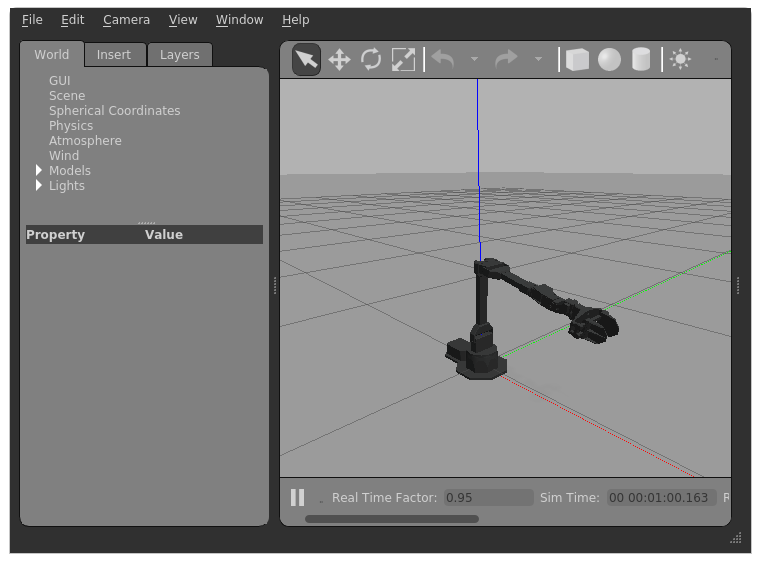
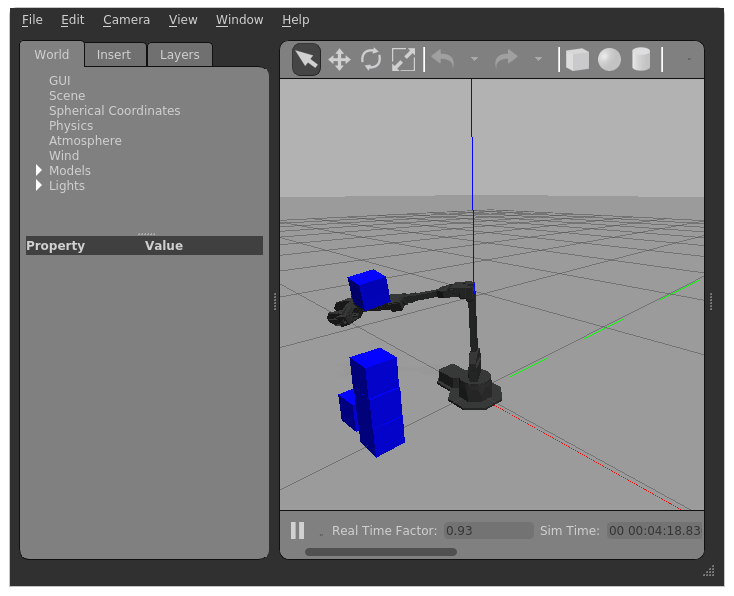

Instrukcja, jak 'uruchomić' wirtualne ramię Interbotix vx300s w Linuxie, stack

1. ramię Interbotix, model oraz sterownik - moduł ROS
2. ROS 1 noetic
3. Gazebo

oraz jak

* manipulować ramieniem w Pythonie
* umieścić dodatkowe modele (obiekty) w świecie (w Gazebo)

## Polecenia shell

Pobrać [interbotix_ros_gazebo.zip](interbotix_ros_gazebo.zip).

```
$ unzip interbotix_ros_gazebo.zip
$ cd interbotix_ros_gazebo
```

### Środowisko vx300s + ROS + gazebo / serwer

#### Instalacja


```
$ docker build -f interbotix_ros_gazebo.Dockerfile -t interbotix_ros_gazebo .
```

#### Uruchomienie

```
# X11 disable access control
$ xhost +

# -p -- komunikacja z ROS master; -v -e -- X11 forwarding
$ docker run -ti -p 11311:11311 -v /tmp/.X11-unix:/tmp/.X11-unix -e DISPLAY=$DISPLAY interbotix_ros_gazebo

# opcjonalnie, sekwencja ctrl-p ctrl-q odłącza (detach) terminal
```

Powinno pojawić się GUI Gazebo - okno X11 z wizualizacją ramienia vx300s:



### Interakcja ze środowiskiem powyżej / klient

#### Instalacja

```
$ apt install ros-noetic-rospy
```

#### Przykładowe uruchomienie

```
# Adres ROS master - konfiguracja dla rospy i poleceń shellowych: rosrun, rostopic, ...
# (zmienna poniżej jest już prawdopodobnie ustawiona po instalacji ros-noetic-rospy)
$ export ROS_MASTER_URI=http://localhost:11311

# Dodanie cube.urdf do Gazebo via ROS
# https://classic.gazebosim.org/tutorials?tut=ros_roslaunch
# "ROS Service Call" Robot Spawn Method
$ rosrun gazebo_ros spawn_model -file ./cube.urdf -urdf -x 0 -y -0.4 -z 1 -model cube1

# Dodanie kolejnych czterech kopii cube.urdf - stos sześcianów
$ rosrun gazebo_ros spawn_model -file ./cube.urdf -urdf -x 0 -y -0.4 -z 1 -model cube2
$ rosrun gazebo_ros spawn_model -file ./cube.urdf -urdf -x 0 -y -0.4 -z 1 -model cube3
$ rosrun gazebo_ros spawn_model -file ./cube.urdf -urdf -x 0 -y -0.4 -z 1 -model cube4
$ rosrun gazebo_ros spawn_model -file ./cube.urdf -urdf -x 0 -y -0.4 -z 1 -model cube5

# Przykładowa manipulacja ramieniem vx300s z Pythona
$ python3
>>> import rospy
>>> rospy.init_node('test')
>>> from std_msgs.msg import Float64
>>> waist_controller = rospy.Publisher('/vx300s/waist_controller/command', Float64)
>>> waist_controller.publish(-2.0)
```



#### Inne przykłady manipulacji robotem

* [vx300s_demo.py](https://github.com/wiktortomczak/wiktortomczak.github.io/tree/master/interbotix-ros-gazebo/vx300s_demo.py)
* <http://wiki.ros.org/rospy/Overview/Publishers%20and%20Subscribers>
* <http://wiki.ros.org/rospy_tutorials/Tutorials/WritingPublisherSubscriber>

## Opis

Przedstawione rozwiązanie, jak uruchomić i manipulować ramieniem, tj. jak zintegrować cztery składowe software'owe:

1. model i sterownik Interbotix
2. middleware ROS
3. symulator Gazebo
4. kod manipulujący ramieniem

polega na:

* zintegrowaniu składowych 1-3 w ROS i zebraniu ich w kontener dockerowy
* manipulacji ramieniem / komunikacji ze środowiskiem w kontenerze z zewnątrz (z hosta ~ stacji deweloperskiej) poprzez TCP, za pośrednictwem
   * biblioteki klienckiej [rospy]
   * narzędzi shellowych ROSa: `rosrun`, `rostopic`, ...
* dodatkowo, komunikacji zwrotnej (wyświetleniu) GUI Gazebo z kontenera w X11 hosta

Do interakcji ze wszystkimi składowymi wystarczy komunikacja z ROS master
(= proces / węzeł ROS). Sterowniki Interbotix i symulator Gazebo są zintegrowane
z ROSem jako specjalne węzły ROS i można się do nich odwoływać z użyciem mechanizmów
komunikacji ROS, tj. [ROS topics]. ROS master pośredniczy w tej komunikacji.

Integracja ROSa z Gazebo jest standardowa, w oparciu o pakiet ROSa [gazebo_ros]
opakowujący Gazebo, opisany w tutorialach Gazebo [Connect to ROS].

Integracja ROSa z ramieniem Interbotix wykorzystuje pakiety ROSa [interbotix_xsarm_...]
dostarczone z Interbotix. Te pakiety definiują różne węzły ROS sterujące ramieniem.
Użyty pakiet [interbotix_xsarm_gazebo] dodatkowo integruje Gazebo, z wykorzystaniem
w/w [gazebo_ros].

[interbotix_ros_gazebo.Dockerfile](interbotix_ros_gazebo.Dockerfile) to:

* dockerowe opakowanie skryptu [xsarm_amd64_install.sh] z Interbotix, który automatycznie
instaluje całe w/w oprogramowanie
    - docker image `interbotix_ros_gazebo` to gotowa instalacja całego w/w oprogramowania
* uruchomienie ROSa i węzłów ROSa z [interbotix_xsarm_gazebo], tj. sterowników Interbotix i symulatora Gazebo
    - kontener (uruchomiony image) `interbotix_ros_gazebo` to działające środowisko Interbotix vx300s + ROS + Gazebo

Zalety wykorzystnia dockera to (standardowo):

* opakowanie w/w złożonego środowiska w jednym kawałku, poprawnie działającym
* reprodukowalność instalacji i uruchomienia
* łatwość instalacji, uruchomienia, zatrzymania, usunięcia
* izolacja instalacji (~ 2000 pakietów .deb!) i uruchomienia od stanu hosta
* możliwość równoległego uruchomienia wielu instancji (środowisk) 

## Uwagi

* Opcjonalne argumenty do `docker run interbotix_ros_gazebo`:

    takie jak w [xsarm_gazebo.launch]:

    np.  `paused:=true`  `world_name:=<plik .world>`

    ```
    $ docker run -ti -p 11311:11311 -v /tmp/.X11-unix:/tmp/.X11-unix -e DISPLAY=$DISPLAY  \
        interbotix_ros_gazebo paused:=true world_name:=<plik .world>
    ```

* Inne modele urdf/sdf można umieścić w Gazebo już przy uruchomieniu środowiska, statycznie:
    * definiując je w pliku `.world`
    * przekazując ten plik przez parametr `world_name:=` do polecenia `docker run interbotix_ros_gazebo`, jw.

* Polecenie `rostopic pub` pozwala na manipulację robotem z shella, np.:

    ```
    rostopic pub -1 /vx300s/waist_controller/command std_msgs/Float64 "data: 0.5"
    ```

* Polecenie `rostopic list` pokazuje dostępne topics (= kanały pub/sub, ~ metody RPC), np. `/vx300s/waist_controller/command`

* Docker image `interbotix_ros_gazebo` buduje (ściąga) się 1-2h i zajmuje ~4.5GB

## Pliki

* [interbotix_ros_gazebo.Dockerfile](https://github.com/wiktortomczak/wiktortomczak.github.io/tree/master/interbotix-ros-gazebo/interbotix_ros_gazebo.Dockerfile)
* [vx300s_demo.py](https://github.com/wiktortomczak/wiktortomczak.github.io/tree/master/interbotix-ros-gazebo/vx300s_demo.py)
* [cube.urdf](https://github.com/wiktortomczak/wiktortomczak.github.io/tree/master/interbotix-ros-gazebo/cube.urdf)

## Wymagania

* Linux, X11
* docker
* python

## To Do

* spawn modelu w Gazebo bezpośrednio z Pythona, nie przez `rosrun` (patrz źrodła spawn_model)
* `rospy` (biblioteka kliencka) bez ~1GB zbędnych zależności na całym środowisku ROS (np. pobrać źródła ręcznie)
* instalacja ROS i Gazebo w standardowy sposób (np. z oficjalnych pakietów),
  następnie doinstalowanie modułów ROS z Interbotix

## Źródła

* <http://wiki.ros.org/rospy>
* <http://wiki.ros.org/rospy/Overview/Publishers%20and%20Subscribers>
* <http://wiki.ros.org/rospy_tutorials/Tutorials/WritingPublisherSubscriber>
* <http://wiki.ros.org/Topics>
* <http://wiki.ros.org/gazebo_ros>
* <https://classic.gazebosim.org/tutorials?cat=connect_ros>
* <https://classic.gazebosim.org/tutorials?tut=ros_roslaunch>
* <https://www.trossenrobotics.com/docs/interbotix_xsarms/ros_packages/index.html>
* <https://www.trossenrobotics.com/docs/interbotix_xsarms/ros_packages/gazebo_simulation_configuration.html>
* <https://github.com/Interbotix/interbotix_ros_manipulators/blob/main/interbotix_ros_xsarms/install/amd64/xsarm_amd64_install.sh>
* <https://github.com/Interbotix/interbotix_ros_manipulators/blob/main/interbotix_ros_xsarms/interbotix_xsarm_gazebo/launch/xsarm_gazebo.launch>
* <https://www.youtube.com/watch?v=k3zkgN7TYTE>

[rospy]: http://wiki.ros.org/rospy
[ROS topics]: http://wiki.ros.org/Topics
[gazebo_ros]: http://wiki.ros.org/gazebo_ros
[Connect to ROS]: https://classic.gazebosim.org/tutorials?cat=connect_ros
[interbotix_xsarm_...]: https://www.trossenrobotics.com/docs/interbotix_xsarms/ros_packages/index.html
[interbotix_xsarm_gazebo]: https://www.trossenrobotics.com/docs/interbotix_xsarms/ros_packages/gazebo_simulation_configuration.html
[xsarm_amd64_install.sh]: https://github.com/Interbotix/interbotix_ros_manipulators/blob/main/interbotix_ros_xsarms/install/amd64/xsarm_amd64_install.sh
[xsarm_gazebo.launch]: https://github.com/Interbotix/interbotix_ros_manipulators/blob/main/interbotix_ros_xsarms/interbotix_xsarm_gazebo/launch/xsarm_gazebo.launch
